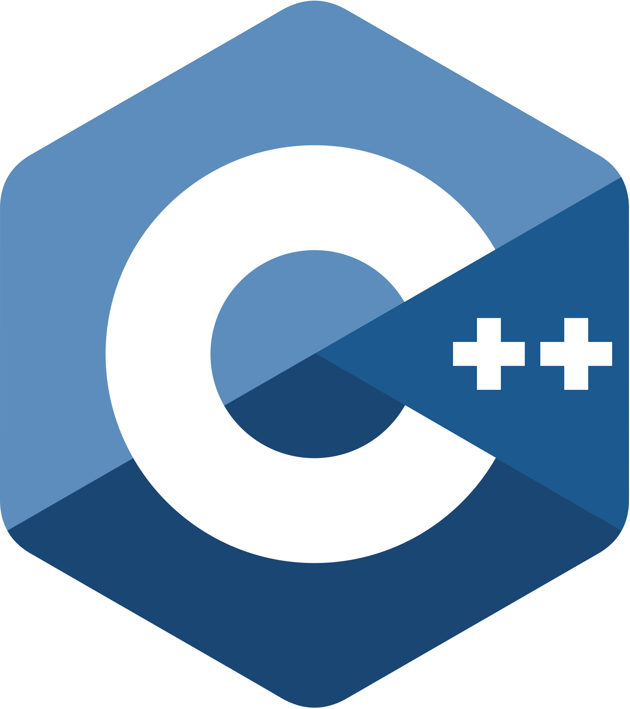

<h1 align="center">
  
</h1>

<h5 align="center">
  <code><a href="https://www.linkedin.com/in/mahmoud-mostafa-9086ba232/" title="LinkedIn Profile"> LinkedIn</a></code>

</h5>
 
<h3 align="center" size ="50px" >
  
  Hi, I'm Mahmoud Mostafa, senior-1 Computer Engineering Student and Front-end(react js) Developer 
   
   
  🔬 I'm currently studying  at AinShams University, Department of Computer Engineering
   
   
  🎓 I graduated from Geel Almost2bal High School
   
   
  💻 I love writing code and learn anythings about it
   
  📚 I’m currently learning Fullstack Web Development
     
       
  📫 How to reach me: <a href="mail: mahmoud2030m@gmail.com">mahmoud2030m@gmail.com</a>
</h3>

<h2 align="center">🔥 Languages & Frameworks & Tools & Abilities 🔥</h2>
 

  <code></code>
  <code></code>
  <code></code>
  <code></code>
  <code></code>
  <code></code>
  <code></code>
  <code></code>
  <code></code>
  <code></code>
  <code></code>
  <code></code>

   
   
  <code></code>
  <code></code>
  <code></code>
  <code></code>
  <code></code>
  <code></code>
  <code></code>

